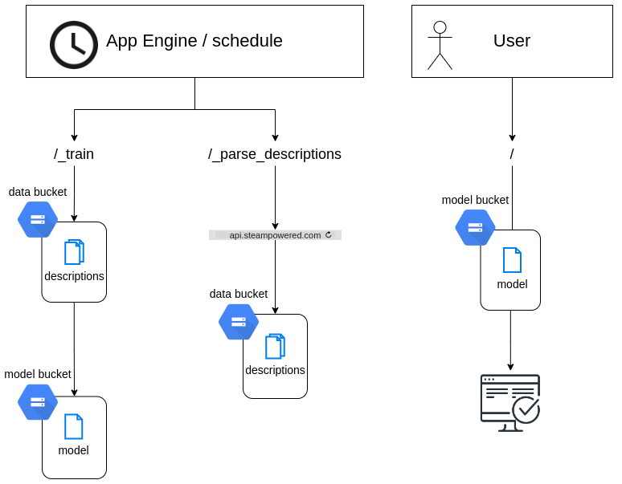

# steam-game-descriptor
[https://game-descriptor-dot-webhost-common.nw.r.appspot.com/](https://game-descriptor-dot-webhost-common.nw.r.appspot.com/)

A Flask based webapp for generating random game descriptions modeled after Steam store. 

## About
A [Markov Chain](https://en.wikipedia.org/wiki/Markov_chain) based text generator trained on a random sample of [Steam store](https://store.steampowered.com/) game descriptions.

In short, a Markov model based text generator splits the training data as ngrams and generates a sequence of words such that every consecutive of _n_ words generated exists somewhere in the training data. In Python terms, the model is a simple dictionary mapping _n-1_ consecutive words to a list of their successors. 

The application consists of three parts:
 1. **parsing for training data**  
    The official [Steamworks API](https://partner.steamgames.com/doc/webapi/ISteamApps) does not support fetching application descriptions. Instead the undocumented API [store.steampowered.com/api](https://store.steampowered.com/api) is used. The community Wiki: [https://wiki.teamfortress.com/wiki/User:RJackson/StorefrontAPI](https://wiki.teamfortress.com/wiki/User:RJackson/StorefrontAPI) has a reference of the its endpoints.

    This API is rate limited (possibly to 200 requests per 5 minute window) and when it comes to descriptions only supports making single requests at a time. To work wihtin these limits, only a small sample of all available Steam apps is used in the training and that sample is slowly fetched via multiple requests.

 1. **training the model**  
    Model training is a simple matter of mapping every sequence of _n-1_ words to their successors. The model is serialized to a Google Cloud Storage bucket for later usage and retrained regularly.

 1. **text generation**  
    The user facing side of the webapp. This involves fetching the model and querying it for a sequence of words:



 
Hosted on Google App Engine.


## Running locally
Install Python packages with  
```bash
pip install -r requirements.txt
```  
Then, run in localhost with
```bash
flask --app main:app run --debug
```

Maitenance requests for training new models can be tested locally by settings required headers with something like:
```bash
curl "127.0.0.1:5000/_parse_descriptions?batch_size=40" -H "X-Appengine-Cron: 1"
```
for parsing a new batch of game descriptions from Steam Store.

### Running locally in production mode
When run locally, all output is stored to separate dev Cloud Storage bucket by default. If needed, this can be overridden
to use the production bucket by starting the Flask server with
```bash
flask -e .env.prod --app main:app run --debug
```

### Updating models
The script `setup_gcs_models.py` can be run locally, without Flask application context, to save model changes to the Cloud Storage bucket.
While the `/_train` endpoint performs the same action, it is mainly intended for periodically re-training production models. The
Flask application assumes all listed models are present in the storage bucket at all times.

When adding new models, run the following to update the model files in the production bucket:
```bash
dotenv -f .env.prod run python setup_gcs_models.py 
```


## Unit tests
Unit tests can be run from the root folder with
```bash
pytest
```

## Deploy to Google App Engine
Deployed to App Engine through GitHub Actions workflow.